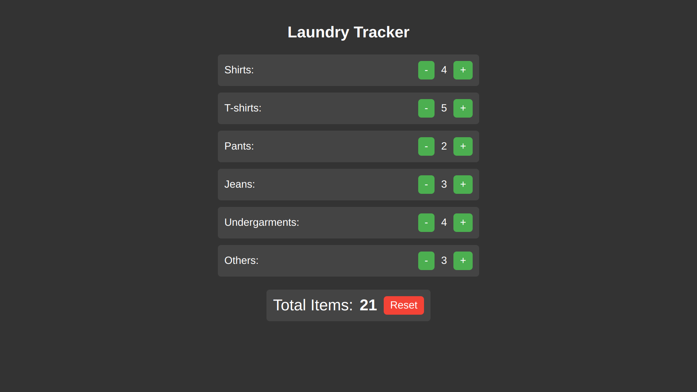
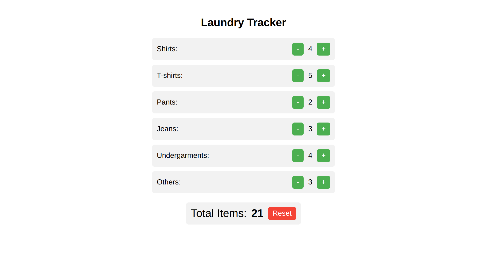
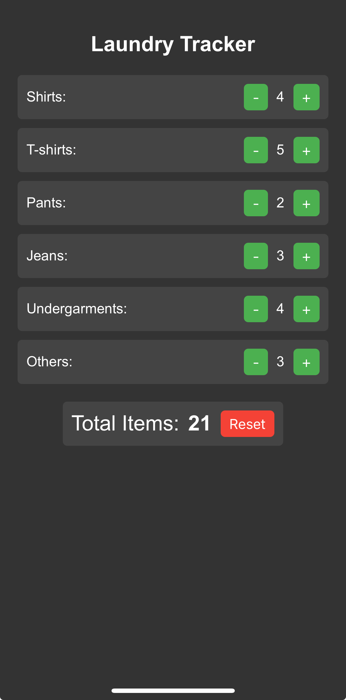
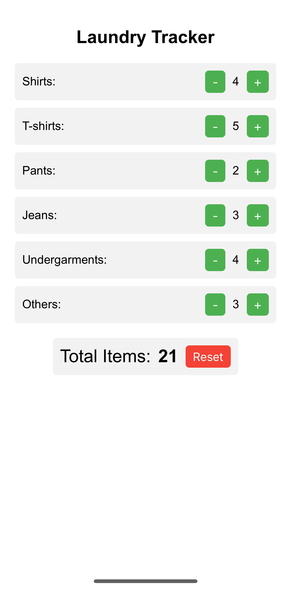

# WashTally

**WashTally** is a laundry tracker app that helps users efficiently manage and track different types of clothing in their laundry. Whether it's keeping a tally of shirts, pants, or other garments, WashTally streamlines the process to ensure your laundry stays organized.

## Hosted Online

You can access the app online at **[laundry-chaitanya.netlify.app](https://laundry-chaitanya.netlify.app)**.


## Features
- **Track Laundry Items**: Easily count and organize various clothing items.
- **Simple UI**: User-friendly interface built with modern design principles.
- **Efficient Management**: Allows users to maintain an overview of their laundry loads.
- **Local Storage**: The app uses **local storage** to store the counts on your browser. This ensures that when you refresh the website, the data remains intact and is not lost. Clicking **Reset** will completely clear the local storage from your browser, resetting all counts.


## Screenshots

### Desktop view
<div>
    
    
</div>

### Mobile view
<div>
    
    
</div>

## Installation

1. Clone the repository:

    ```bash
    git clone https://github.com/chaitanya-p23/WashTally.git
    ```

2. Navigate into the project directory:

    ```bash
    cd WashTally
    ```

3. Install the required dependencies:
    ```bash
    npm install
    ```

4. To start the app in development mode:

    ```bash
    npm start
    ```

This will run the app on `http://localhost:3000` in your browser. The page will automatically reload when you make changes to the source files.

## Contributing
Feel free to submit issues or pull requests to help improve the app!
